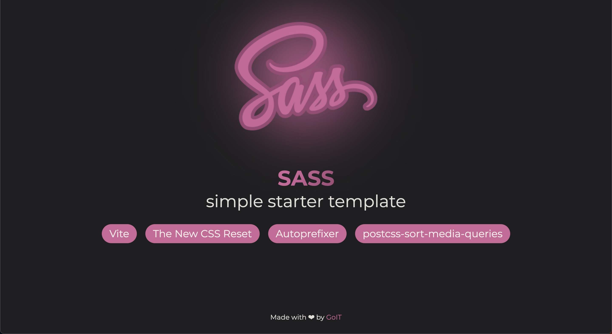

# Simple starter template for Sass



## Vanilla App Template

Цей проект було створено за допомогою Vite. Для знайомства та налаштування
додаткових можливостей [звернись до документації](https://vitejs.dev/).

Ключові особливості цього шаблону:

**Build Tools:** Vite.js
**Plugins:** Autoprefixer, PostCSS Sort Media Queries
**Styles:** SCSS
**Reset:** \_reset.scss (Based on The New Reset CSS)

## Створення репозиторію за шаблоном

Використовуй цей репозиторій організації GoIT як шаблон для створення
репозиторію свого проекту. Для цього натисни на кнопку `«Use this template»` і
обери опцію `«Create a new repository»`, як показано на зображенні.


На наступному етапі відкриється сторінка створення нового репозиторію. Заповни
поле його імені, переконайся, що репозиторій публічний, після чого натисни
кнопку `«Create repository from template»`.


Після того, як репозиторій буде створено, необхідно перейти в налаштування
створеного репозиторію на вкладку `Settings` > `Actions` > `General` як показано
на зображенні.


Проскроливши сторінку до самого кінця, в секції `«Workflow permissions»` обери
опцію `«Read and write permissions»` і постав галочку в чекбоксі. Це необхідно
для автоматизації процесу деплою проекту.


Тепер у тебе є особистий репозиторій проекту, зі структурою файлів та папок
репозиторію-шаблону. Далі працюй з ним, як з будь-яким іншим особистим
репозиторієм, клонуй його собі на комп'ютер, пиши код, роби коміти та відправляй
їх на GitHub!

## Підготовка до роботи

1. Переконайся, що на комп'ютері встановлено LTS-версію Node.js.
   [Скачай та встанови](https://nodejs.org/en/) її якщо необхідно.
2. Встанови базові залежності проекту в терміналі командою `npm install`.
3. Запусти режим розробки, виконавши в терміналі команду `npm run dev`.
4. Перейдіть у браузері за адресою
   [http://localhost:5173](http://localhost:5173). Ця сторінка буде автоматично
   перезавантажуватись після збереження змін у файли проекту.
5. Для перегляду результуючого СSS файлу виконай команду
   `npx vite build --watch` та перейди в папку `dist/assets`

## Структура проекту. Файли і папки

This is the structure of the project:

```plaintext
/
├── demo                    # Папка для файлів цієї інструкції
├── dist                    # Результуючий код
├── node_modules            # Node.js залежності для проекту
├── public                  # Файли для публічного доступу та використання
├── src                     # Вихідний код
│   ├── fonts	            # Папка для ваших шрифтів
│   ├── img                 # Папка для ваших зображень
│   ├── js                  # Файли Javascript вашого проекту
│   ├── scss                # Стилі SCSS для вашого проекту
├── .gitignore              # Перелік файлів та папок, які ігнорує Git
├── index.html              # Файл HTML для вашого проекту
├── LICENSE                 # Файл ліцензії для вашого проекту
├── package-lock.json       # Файл з поточними версіями залежностей для вашого проекту
├── package.json            # Визначає метадані вашого проекту і його залежності
├── postcss.config.cjs      # Конфігурація для PostCSS
├── README.md               # Цей файл 😎
├── vite.config.js          # Конфігурація бандлера Vite
```

## Подальші кроки

Після клонування шаблону обов’язково очистіть і оновіть наступні файли/папки:

1. Очистіть файл README.md.
2. Адаптуйте файл LICENSE до свого проекту.
3. Очистіть `public/sass.svg`, папки `demo/`, `src/img/**/*`, `src/fonts/**/*`, а також `src/scss/**.*`, окрім файлів `style.scss` та `_reset.scss`.
4. Видаліть вміст із файлу `src/scss/style.scss`, окрім `@use "reset.scss";`.
5. У файлі `src/js/main.js`, залиште лише цей рядок з імпортом: `import '../scss/style.scss';`.

## Деплой

Продакшн версія проекту буде автоматично збиратися та деплоїтись на GitHub
Pages, у гілку `gh-pages`, щоразу, коли оновлюється гілка `main`. Наприклад,
після прямого пуша або прийнятого пул-реквесту. Для цього необхідно у файлі
`package.json` змінити значення прапора `--base=/<REPO>/`, для команди `build`,
замінивши `<REPO>` на назву свого репозиторію, та відправити зміни на GitHub.

```json
"build": "vite build --base=/<REPO>/",
```

Далі необхідно зайти в налаштування GitHub-репозиторію (`Settings` > `Pages`) та
виставити роздачу продакшн версії файлів з папки `/root` гілки `gh-pages`, якщо
це не було зроблено автоматично.


## License

Цей шаблон створено під [MIT License](LICENSE).

**Thank you and happy coding!** 💻
